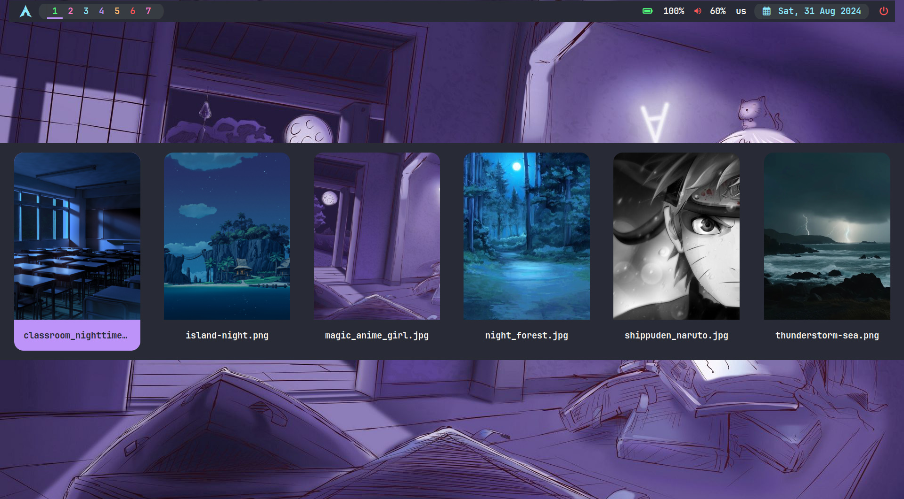
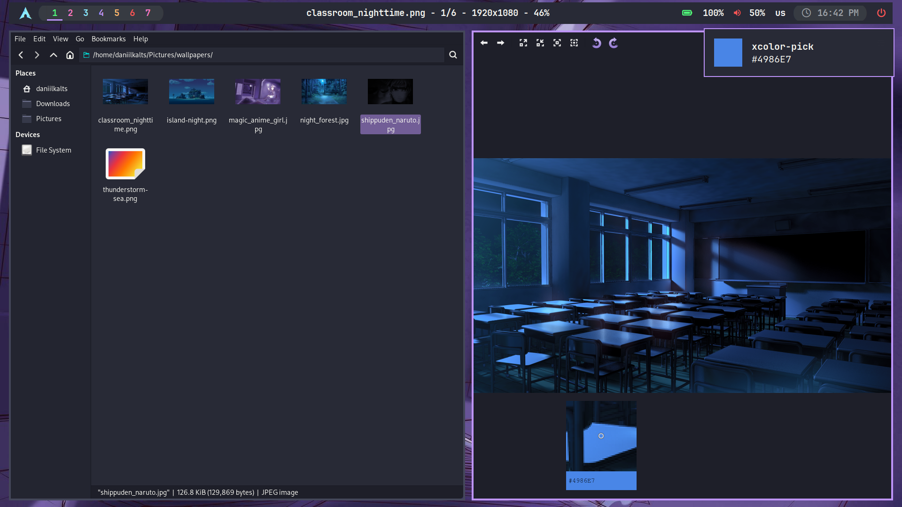

<h1 align="left">📘 About</h1>

 

- **OS**: [**`Arch Linux`**](https://archlinux.org/)
- **WM**: [**`BSPWM`**](https://github.com/baskerville/bspwm)
- **Bar**: [**`Polybar`**](https://github.com/polybar/polybar)
- **Compositor**: [**`Picom`**](https://github.com/yshui/picom)
- **Terminal**: [**`Kitty`**](https://github.com/kovidgoyal/kitty)
- **App Launcher**: [**`Rofi`**](https://github.com/davatorium/rofi)
- **Notify Daemon**: [**`Dunst`**](https://github.com/dunst-project/dunst)
- **Shell**: [**`Zsh`**](https://github.com/ohmyzsh/ohmyzsh)
- **Text Editor**: [**`Neovim`**](https://neovim.io/)
- **File Manager**: [**`Thunar`**](https://github.com/xfce/thunar)
- **Terminal Multiplexer**: [**`Tmux`**](https://github.com/tmux/tmux)
- **Symlink Manager**: [**`Stow`**](https://www.gnu.org/software/stow/manual/stow.html)
- **Terminal File Manager**: [**`Yazi`**](https://yazi-rs.github.io/)
- **Browser**: [**`Firefox Developer Edition`**](https://www.mozilla.org/en-US/firefox/developer/)
- **Font Family**: [**`JetBrainsMono Nerd Font`**](https://www.jetbrains.com/lp/mono/)

 

<!-- IMAGES -->

## 🖼️ Gallery

### Rofi - Application Launcher

### Wallpaper Selector

### Multiple Windows

### Neovim - Text Editor

### Btop - System Monitor

### Yazi - Terminal FIle Manager

### Tmux - terminal multiplexer

### Matrix Effect and File Content Preview

### History and File Name Seach

### File Search Preview and File Substring Search

### Image Preview and Color Picker

### Neovim in Action: A Work Example

### Monkey Type - Touch Typing Website

### LeetCode Profile

### GitHub Profile

<!-- FEATURES -->

## 🚀 Features

- Write code efficiently with the configured Neovim text editor.
- Effortlessly manage files using search and preview tools.
- Use a convenient terminal with advanced features.
- Manage multiple desktops and windows with bspwm.
- Choose a wallpaper via the selector menu.
- Quickly pick colors from the screen.
- Hotkeys are fine-tuned for optimal productivity.

<!-- HOTKEYS -->

## 💻 HotKeys

- **Open the terminal** - `super + enter`
- **Open the application menu** - `super + d`
- **Search for files in the terminal** - `Ctrl + f`
- **Search for a file with a matching substring in the terminal** - `Ctrl + g`
- **Search for a preview of files in the terminal** - `Ctrl + p`
- **View the command history in the terminal** - `Ctrl + h`
- **Open Yazi (terminal file manager) in the terminal** - `Ctrl + y`
- **Switch to another desktop** - `super + 1/7`
- **Move the window to another desktop** - `super + shift + 1/7`
- **Switch the window to floating mode** - `super + s`
- **Set a wallpaper** - `super + shift + s`
- **Open the calendar** - `super + shift + c`
- **Close the window that is in focus** - `super + w`
- **Take a screenshot** - `win + p`
- **Take an accurate screenshot** - `win + shift + p`
- **Restart bspwm** - `win + alt + r`
- **Pick a color to clipboard** - `alt + p`

The other hotkeys are in `~/.config/sxhkd/sxhkdrc`.

<!-- INSTALLATION -->

## :blue_book: Installation

A guide the make the dual boot with windows and make the rice: [Instructions](./instructions/).

#

Now I can proudly say, that **I use arch btw** :smirk:
