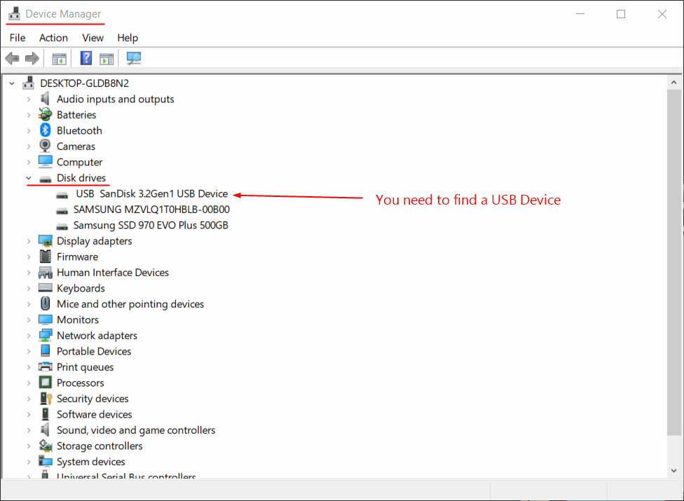
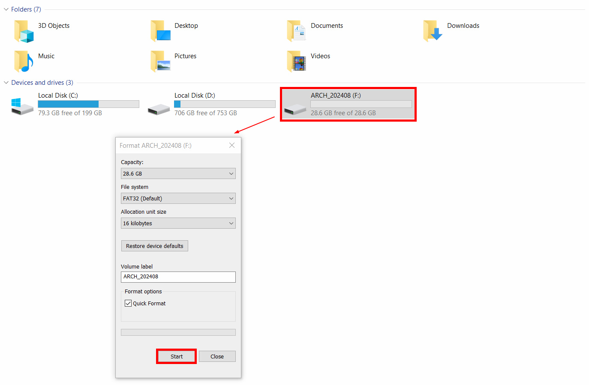
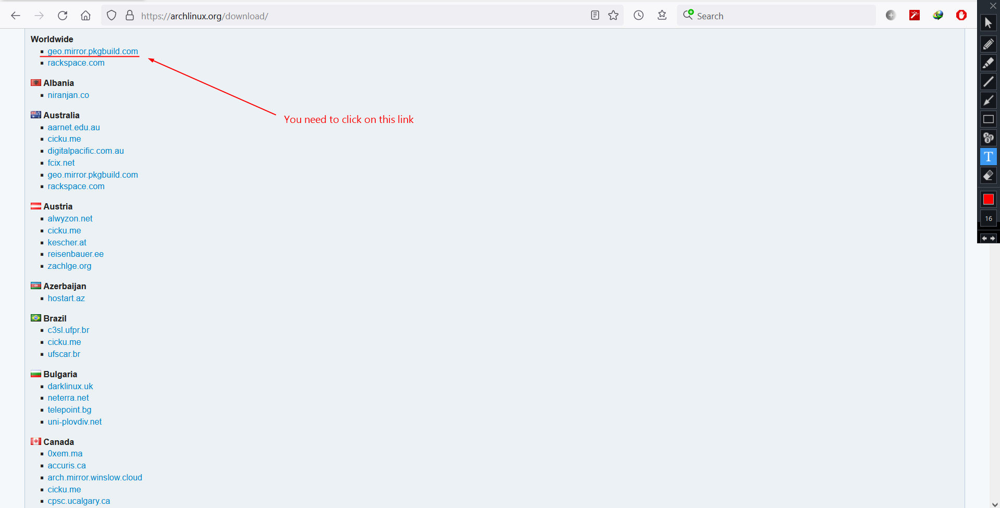
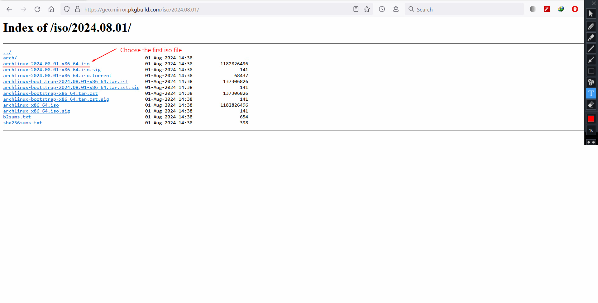
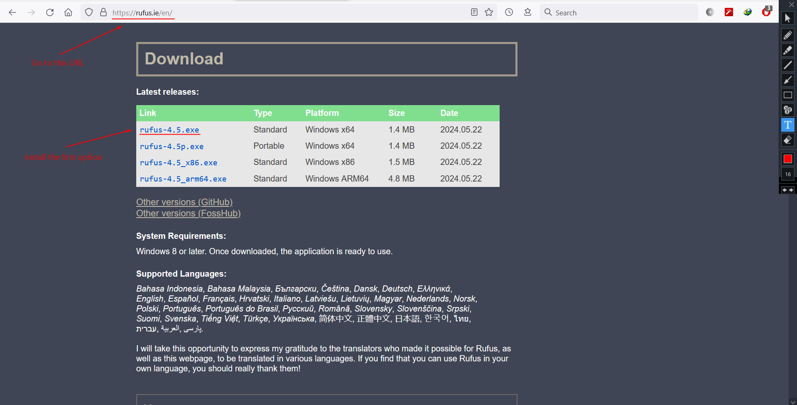
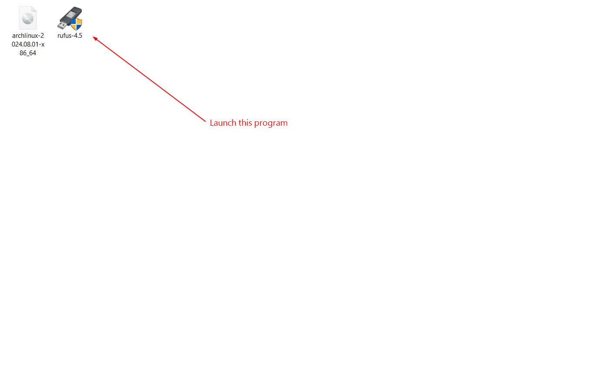
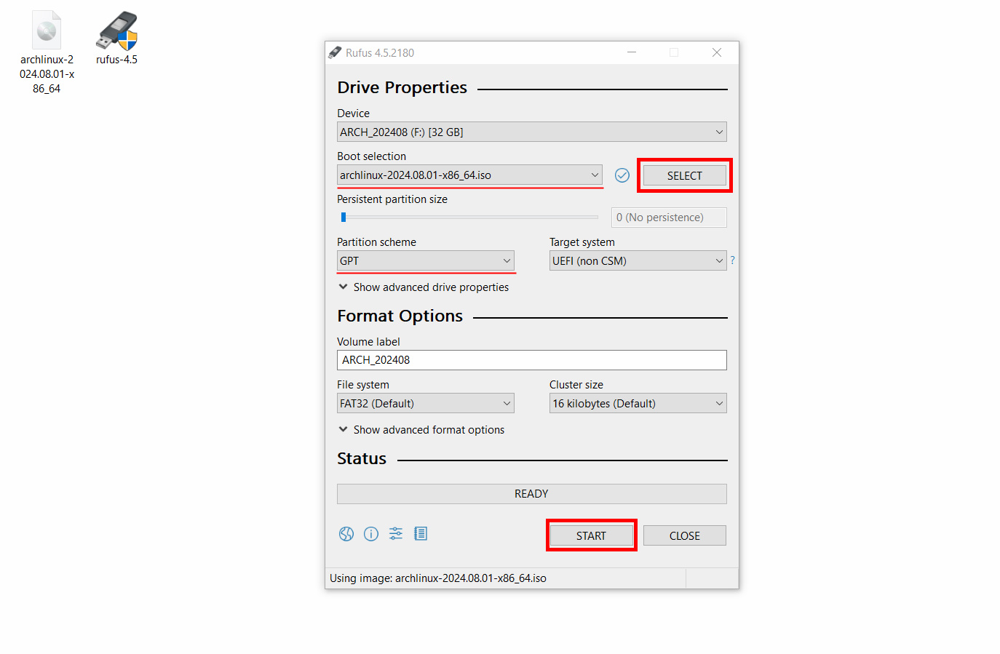

> [!WARNING]  
> You can actually skip the second part (Rufus will handle the formatting).

### 1. Connect a USB Drive to Your PC

To ensure that your USB drive is recognized by your computer:

1. Press Win + X to open the Power User menu.
2. Select _Device Manager_ from the list.

### 2. Format the USB Drive

Before proceeding, format the USB drive to ensure it's clean:

1. Open _This PC_.
2. Right-click on the USB drive.
3. Select the _Format_ option.
4. Click the _Start_ button to format the drive.

### 3. Download Arch Linux ISO

Arch Linux provides a disk image (ISO) that can be used to install the operating system.

1. Visit the [Arch Linux Download Page](https://archlinux.org/download).
2. Find and click on the link to geo.mirror.pkgbuild.com.
3. Download the latest ISO file from the list.

### 4. Install Rufus

Rufus is a utility used to format and create bootable USB flash drives.

1. Go to the [Rufus Website](https://rufus.ie/en/).
2. Download the installer (rufus-4.5.exe in this case).
3. Run the installer to set up Rufus.

### 5. Make a Bootable USB Drive

Create a bootable USB drive to install Arch Linux:

1. Launch the rufus.exe file.
2. Click the _SELECT_ button and choose the Arch Linux ISO file.
3. Set the _Partition Scheme_ to GPT.
4. Click _Start_ to begin the process.

### Now, move to the second step!!!
