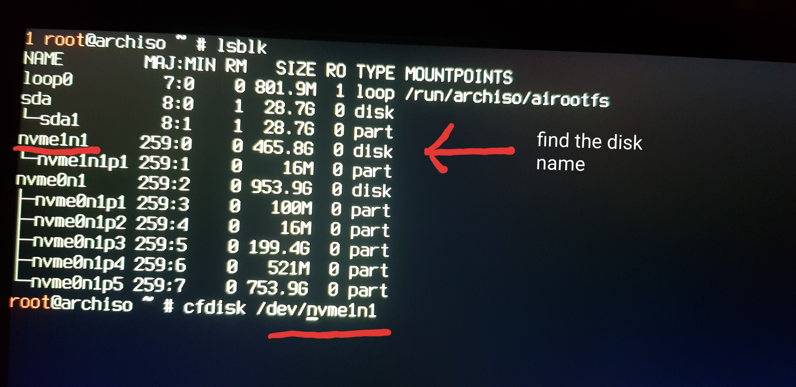
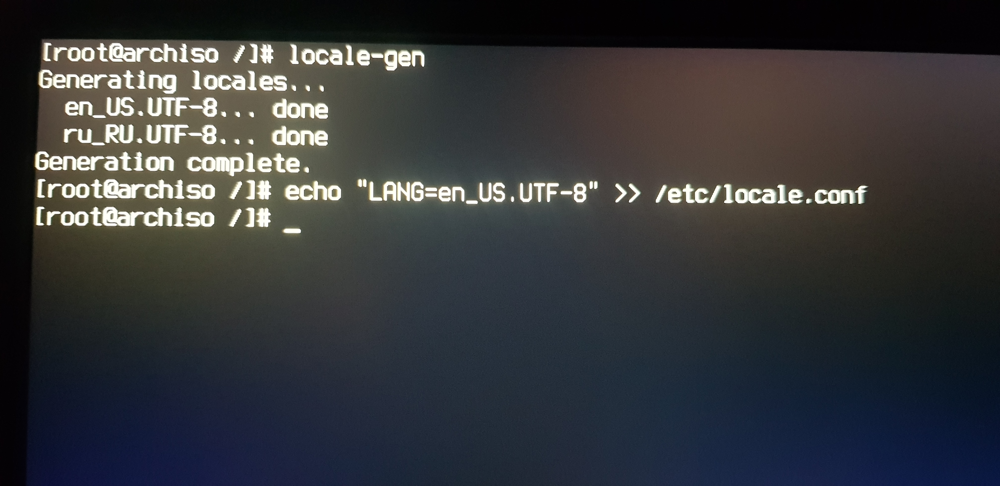
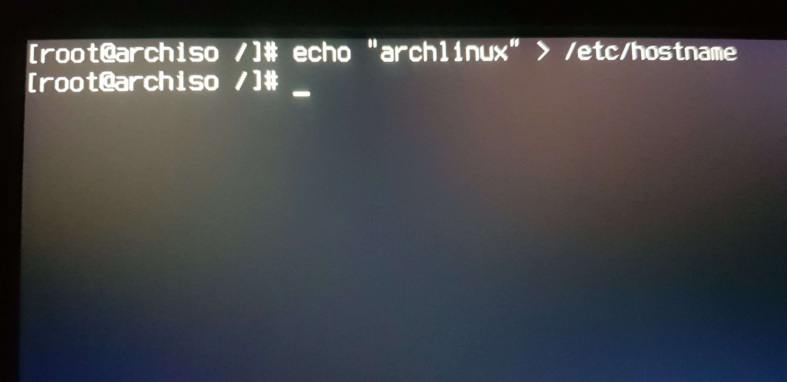

> [!Note]  
> Hell yeah, the screen quality sucks.

### 1. Restart the PC and Press `Esc` Until the Boot Menu Appears

When you restart your PC, press the `Esc` button repeatedly to access the boot menu. This menu allows you to select different boot options, including the USB drive from which you want to boot your system.

#### Steps to Access the Boot Menu:

1. Restart your PC.
2. As soon as the screen goes black, start pressing the `Esc` key repeatedly.
3. Wait for the boot menu to appear.

#### Boot Menu Example:


#### Select the Bootable USB Drive:

1. In the boot menu, look for the entry corresponding to the bootable USB drive. It should be labeled with a name like `UEFI: [Your USB Drive Name]`.
2. Use the arrow keys to select the UEFI option for the bootable USB drive.
3. Press `Enter` to boot from the USB drive.

### 2. Arch Linux Terminal Appearance

Once you select the USB drive and boot into Arch Linux, you will see the terminal screen.

#### Steps in the Terminal:

1. Type `setfont ter-124n` and press `Enter` to set the terminal font.
2. To clear the terminal and start with a clean screen, press `Ctrl + L`.

#### Cleaned Terminal:


#### Terminal with Font Set:


### 3. Connect to the Internet

To connect to the internet, use the `iwctl` command-line tool to scan for and connect to available Wi-Fi networks.

#### Steps to Connect:

1. To clear the terminal and start with a clean screen, press `Ctrl + L`.
2. Type `iwctl` and press `Enter` to enter the `iwctl` interface.
3. Type `device list` to list available network devices.
4. Type `station (devicename) scan` to scan for networks (replace `(devicename)` with your device name).
5. Type `station (devicename) get-networks` to list available networks.
6. Type `station (devicename) connect (wifiname)` to connect to your desired network (replace `(devicename)` and `(wifiname)` with your device name and Wi-Fi network name, respectively).
7. Type `station (devicename) show` to verify the connection.
8. Type `quit` to exit the `iwctl` interface.

To ensure the internet connection is working, type `ping google.com` and press `Enter`. To stop the ping command, press `Ctrl + C`.

#### Connect to the Internet:


#### Check Connection:


### 4. Create Disk Partitions

To set up disk partitions, use the `cfdisk` utility to partition your disk according to your needs.

#### Steps to Create Partitions:

1. To clear the terminal and start with a clean screen, press `Ctrl + L`.
2. Type `lsblk` and press `Enter` to list the available disks.
3. Type `cfdisk /dev/(yourdisknumber)` and press `Enter` to start partitioning (replace `(yourdisknumber)` with your actual disk identifier).
4. Select `New` and press `Enter` to create a new partition.
5. Type `1G` and press `Enter` to set the partition size for the EFI system partition.
6. Select `Type` and choose `EFI System` and press `Enter`.
7. Press the down arrow key.
8. Select `New` and press `Enter` to create another partition.
9. Type `20G` and press `Enter` to set the partition size for the root partition.
10. Press the down arrow key.
11. Select `New` and press `Enter` to create the final partition.
12. Keep the rest of the space as it is for the home partition and press `Enter`.
13. Select `Write` and type `yes` to confirm writing the partitions.
14. Select `Quit` and press `Enter` to exit `cfdisk`.

#### Disk Partitions Before:



#### Disk Partitions After:


### 5. Format Partitions

Once the partitions are created, format them to prepare for the installation.

#### Steps to Format Partitions:

1. To clear the terminal and start with a clean screen, press `Ctrl + L`.
2. Type `mkfs.fat -F32 /dev/(efipartitionnumber)` and press `Enter` to format the EFI system partition (replace `(efipartitionnumber)` with your EFI partition number).
3. Type `mkfs.ext4 /dev/(rootpartitionnumber)` and press `Enter` to format the root partition (replace `(rootpartitionnumber)` with your root partition number).
4. Type `mkfs.ext4 /dev/(homepartitionnumber)` and press `Enter` to format the home partition (replace `(homepartitionnumber)` with your home partition number).

#### Formatted Partitions:


### 6. Mount Partitions

To prepare for the installation, you need to mount the partitions you’ve created.

#### Steps to Mount Partitions:

1. To clear the terminal and start with a clean screen, press `Ctrl + L`.
2. Type `lsblk` and press `Enter` to list the available partitions.
3. Type `mount /dev/(rootpartitionnumber) /mnt` and press `Enter` to mount the root partition (replace `(rootpartitionnumber)` with your root partition number).
4. Type `mount --mkdir /dev/(efipartitionnumber) /mnt/boot` and press `Enter` to mount the EFI system partition (replace `(efipartitionnumber)` with your EFI partition number).
5. Type `mount --mkdir /dev/(homepartitionnumber) /mnt/home` and press `Enter` to mount the home partition (replace `(homepartitionnumber)` with your home partition number).

#### Mounted Partitions:


### 7. Install the Base System

Install the base system and essential packages for your Arch Linux installation.

#### Steps to Install the Base System:

1. To clear the terminal and start with a clean screen, press `Ctrl + L`.
2. Type `pacstrap /mnt base base-devel linux linux-headers linux-firmware neovim networkmanager network-manager-applet wireless_tools git` and press `Enter` to install the base system and additional packages.

#### Package Descriptions:

- **base**: Essential packages for a minimal Arch Linux system.
- **base-devel**: Development tools and libraries needed for building packages.
- **linux**: The Linux kernel.
- **linux-headers**: Kernel headers for building modules.
- **linux-firmware**: Firmware files for various hardware devices.
- **neovim**: A modern, extensible text editor.
- **networkmanager**: A utility for managing network connections.
- **network-manager-applet**: A graphical applet for NetworkManager.
- **wireless_tools**: Tools for managing wireless network devices.
- **git**: A distributed version control system.

#### Installation Process:


### 8. Generate fstab and Enter Chroot

Generate the `fstab` file to configure disk mount points and file system options, and chroot into the new system.

#### Steps to Generate fstab and Enter Chroot:

1. To clear the terminal and start with a clean screen, press `Ctrl + L`.
2. Type `genfstab -U /mnt >> /mnt/etc/fstab` and press `Enter` to generate the `fstab` file.
3. Type `arch-chroot /mnt` and press `Enter` to change the root directory to `/mnt` and enter the chroot environment.

#### fstab File Generation:


### 9. Configure Timezone and Locale

Set the timezone and locale to ensure your system is properly configured for your region and language.

#### Steps to Configure Timezone and Locale:

1. To clear the terminal and start with a clean screen, press `Ctrl + L`.
2. Type `ln -sf /usr/share/zoneinfo/(yourcontinent)/(yourcity) /etc/localtime` and press `Enter` to set the system clock to your local timezone. Replace `(yourcontinent)` and `(yourcity)` with your respective continent and city (e.g., `Europe/Berlin`).
3. Type `hwclock --systohc` and press `Enter` to synchronize the hardware clock with the system clock.
4. Type `nvim /etc/locale.gen` and press `Enter` to open the locale configuration file in `nvim` (Neovim).

   - Press `/` and type `en_US.UTF-8` and press `Enter` to search for the `en_US.UTF-8` locale.
   - In normal mode, press `x` to cut the `#` at the beginning of the line to uncomment it. Repeat for any other locales you want to enable, such as `ru_RU.UTF-8`.
   - Press `Esc`, then type `:wq` and press `Enter` to save and exit.

5. Type `locale-gen` and press `Enter` to generate the locales.
6. Type `echo "LANG=en_US.UTF-8" >> /etc/locale.conf` and press `Enter` to set the system language.

#### Locale Configuration Example:



### 10. Set Hostname

Configure your system's hostname to identify it on the network.

#### Steps to Set Hostname:

1. To clear the terminal and start with a clean screen, press `Ctrl + L`.
2. Type `echo "archlinux" > /etc/hostname` and press `Enter` to set the hostname. Replace `archlinux` with your desired hostname, such as `archkernel`.

   

3. Type `nvim /etc/hosts` and press `Enter` to edit the hosts file. Copy the text from the screenshot below and replace `archlinux` with your chosen hostname:

   - Press `i` to enter insert mode, and type your chosen hostname where needed.
   - Press `Esc` to return to normal mode, then type `:wq` and press `Enter` to save and quit.

   

### 11. Set Username and Password

Create a user account, set up permissions, and configure sudo access.

#### Steps to Set Username and Password:

1. To clear the terminal and start with a clean screen, press `Ctrl + L`.
2. Type `passwd` and press `Enter` to set the password for the root user.
3. Type `useradd -m (username)` and press `Enter` to create a new user account. Replace `(username)` with your desired username.
4. Type `passwd (username)` and press `Enter` to set the password for the new user. Replace `(username)` with the username you created.
5. Type `usermod -aG wheel,optical,storage,power,audio,video (username)` and press `Enter` to add the user to the specified groups. Replace `(username)` with the username you created.

   

6. Type `nvim /etc/sudoers` and press `Enter` to edit the sudoers file. To enable sudo privileges for the wheel group:

   - Press `/` and type `%wheel ALL=(ALL) ALL`, then press `Enter` to search for the line.
   - Press `x` in normal mode to remove the `#` at the beginning of the line to uncomment it.
   - Type `:wq!` and press `Enter` to save and exit `nvim`.

   

### 12. Install Bootloader

Install the bootloader to manage your system’s startup and allow dual-booting with Windows.

#### Steps to Install Bootloader:

1. To clear the terminal and start with a clean screen, press `Ctrl + L`.
2. Type `pacman -S grub ntfs-3g efibootmgr os-prober` and press `Enter` to install the necessary packages:

   - `grub`: The GRand Unified Bootloader, essential for booting your OS.
   - `ntfs-3g`: Provides support for NTFS file systems, useful for accessing Windows partitions.
   - `efibootmgr`: A tool for managing UEFI boot entries.
   - `os-prober`: Detects other installed operating systems for GRUB configuration.

   

3. To clear the terminal and start with a clean screen, press `Ctrl + L`.
4. Type `fdisk -l` and press `Enter` to list all disk partitions and find your Windows EFI partition.

   

5. To clear the terminal and start with a clean screen, press `Ctrl + L`.
6. Type `mkdir /mnt/windows` and press `Enter` to create a directory to mount the Windows EFI partition.
7. Type `mount /dev/(windowsefi) /mnt/windows` and press `Enter` to mount the Windows EFI partition. Replace `(windowsefi)` with the actual partition identifier.
8. Type `grub-install --target=x86_64-efi --efi-directory=/boot --bootloader-id="GRUB"` and press `Enter` to install GRUB as the bootloader.
   > **Warning:** The `--target=x86_64-efi` option may vary depending on your hardware. However, in this case, it should work for most systems.
9. Type `grub-mkconfig -o /boot/grub/grub.cfg` and press `Enter` to generate the GRUB configuration file.

   

### 13. Install Display and Audio Drivers

Set up your system's display and audio by installing the necessary drivers.

#### Steps to Install Display and Audio Drivers:

1. To clear the terminal and start with a clean screen, press `Ctrl + L`.
2. Type `pacman -S xorg nvidia nvidia-utils nvidia-settings pipewire pipewire-pulse pavucontrol` and press `Enter` to install the display and audio drivers.

   - **xorg**: Provides the X Window System, the foundation for graphical environments.
   - **nvidia**: Installs the proprietary NVIDIA drivers for your GPU.
   - **nvidia-utils**: Includes utilities needed for NVIDIA driver functionality.
   - **nvidia-settings**: A configuration tool for adjusting NVIDIA driver settings.
   - **pipewire**: Manages multimedia pipelines for audio and video.
   - **pipewire-pulse**: Provides PulseAudio support through Pipewire.
   - **pavucontrol**: A volume control tool for the PulseAudio sound server.

   

3. To clear the terminal and start with a clean screen, press `Ctrl + L`.
4. Type `systemctl enable NetworkManager pipewire pipewire-pulse` and press `Enter` to enable these services on boot.

   

### 14. Exit and Reboot

Complete the installation and reboot into your new Arch Linux system.

#### Steps to Exit and Reboot:

1. To clear the terminal and start with a clean screen, press `Ctrl + L`.
2. Type `exit` and press `Enter` to leave the chroot environment.
3. Type `reboot` and press `Enter` to restart your system.
4. After the system restarts, press the `Esc` key multiple times to open the boot menu.
5. In the boot menu, select the GRUB device to boot into your Arch Linux. Look for the entry labeled with a name like `UEFI: [Your GRUB Device Name]`.
6. Log in to your user profile by typing your username and password.

**Boot Menu:**  


**Login Prompt:**  


### 15. Connect to the Internet

Set up your internet connection using NetworkManager.

#### Steps to Connect to the Internet:

1. To clear the terminal and start with a clean screen, press `Ctrl + L`.
2. Type `nmcli device wifi list` and press `Enter` to list available Wi-Fi networks.
3. Type `nmcli device wifi connect (wifi-name) password (wifi-password)` and press `Enter` to connect to your desired Wi-Fi network. Replace `(wifi-name)` and `(wifi-password)` with your network's name and password.
4. Type `nmcli device status` and press `Enter` to check the connection status. You should see `connected` with a green color and the name of your Wi-Fi network.

**NetworkManager terminal interface:**


### 16. Set Up Window Manager (bspwm and sxhkd)

Configure your graphical environment with `bspwm`, `sxhkd`, and related tools.

#### Steps to Set Up bspwm and sxhkd:

1. To clear the terminal and start with a clean screen, press `Ctrl + L`.

2. Update your system and install JetBrains Mono font, a developer-friendly font with programming ligatures:
   `sudo pacman -Syu`
   `sudo pacman -S ttf-jetbrains-mono`

3. Install xorg related packages for a graphical environment:

   - `xorg-xinit`, `xorg-server`, `xorg-xrandr`, and `xorg-setxkbmap` are essential for Xorg setup.
     `sudo pacman -S xorg-xinit xorg-server xorg-xrandr xorg-setxkbmap`

4. Install `bspwm`, `sxhkd`, `alacritty`, and `rofi`:

   - `bspwm` is a tiling window manager.
   - `sxhkd` manages keyboard shortcuts.
   - `alacritty` is a fast terminal emulator.
   - `rofi` is a window switcher and dmenu replacement.
     `sudo pacman -S bspwm sxhkd alacritty rofi`

   

5. Create configuration directories for `bspwm` and `sxhkd`:
   `mkdir -p ~/.config/bspwm`
   `mkdir -p ~/.config/sxhkd`

6. Copy example configuration files:
   `cp /usr/share/doc/bspwm/examples/bspwmrc ~/.config/bspwm/`
   `cp /usr/share/doc/bspwm/examples/sxhkdrc ~/.config/sxhkd/`

7. Make the `bspwmrc` script executable:
   `chmod +x ~/.config/bspwm/bspwmrc`

   

8. Open the `sxhkd` configuration file and make the following changes:

   - Change the terminal emulator from `urxvt` to `alacritty`.
   - Replace `dmenu` with `rofi`.

   To edit the `sxhkdrc` file with `nvim`:
   `nvim ~/.config/sxhkd/sxhkdrc`

   

   Find and replace:

   - `super + Return` `urxvt` with `super + Return` `alacritty`
   - `super + @space` `dmenu_run` with `super + @space` `rofi -show drun`

   Save and exit `nvim` by typing `:wq` and pressing `Enter`.

9. Reload `sxhkd` to apply changes:
   Press `super + Escape` to reload `sxhkd`.

10. Add `bspwm` and `sxhkd` to `.xinitrc`:
    The `.xinitrc` file is used by `startx` to launch your graphical environment.
    `echo "sxhkd &" >> ~/.xinitrc`
    `echo "exec bspwm" >> ~/.xinitrc`

    

11. Start your graphical environment:
    Type `startx` and press `Enter` to launch `bspwm`. Once in the `bspwm` environment, press `super + Return` to open `alacritty`.

    

Alright ladies and gentlmen, after all that effort, we’ve finally managed to turn our screen into a gorgeous terminal xDD Welcome to the world of endless possibilities—or just a very fancy command line xDDDD 🖥️ (just joking... Do I?)! 🤔

12. To clear the terminal and start with a clean screen, press `Ctrl + L`. Then, find the Windows EFI system partition by typing:

    ```bash
    sudo fdisk -l
    ```

    Identify the partition labeled as `EFI System` (e.g., `/dev/sda1`).

    

13. Mount the Windows EFI system partition:

    ```bash
    sudo mount /dev/(windowsefi) /mnt/windows
    ```

14. Edit the GRUB configuration file:

    ```bash
    sudo nvim /etc/default/grub
    ```

    Press `G` to go to the very bottom and uncomment the last line with:
    `GRUB_DISABLE_OS_PROBER=false`

    

15. Generate a new GRUB configuration file:

    ```bash
    sudo grub-mkconfig -o /boot/grub/grub.cfg
    ```

    

16. Reboot your system:

    ```bash
    reboot
    ```

17. After rebooting, you will see the boot menu where you can choose between your Arch Linux and Windows systems.

    

> [!Warning]  
> Apply these commands to set time and timezone

```
sudo timedatectl set-ntp true
sudo timedatectl set-timezone Continent/City
```

### Now, move to the third step!!! (I thought I'd die writing this endless doc :DDDD)
