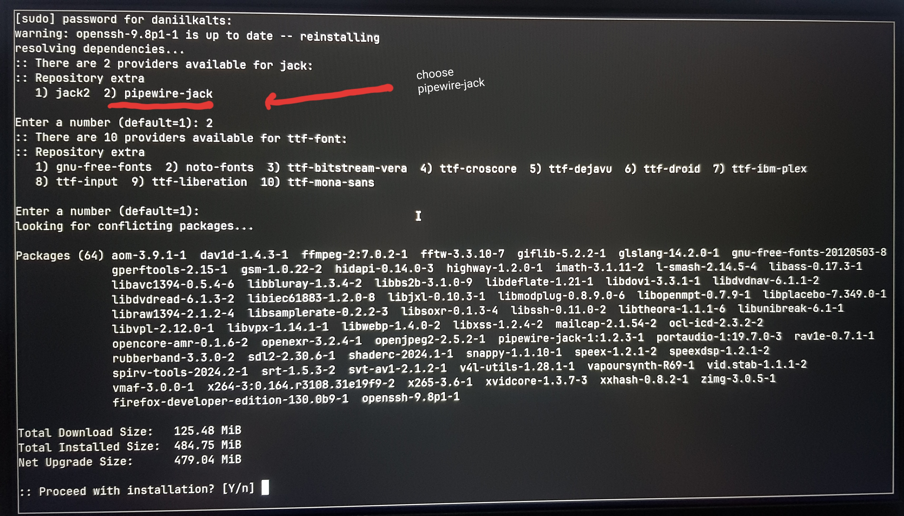
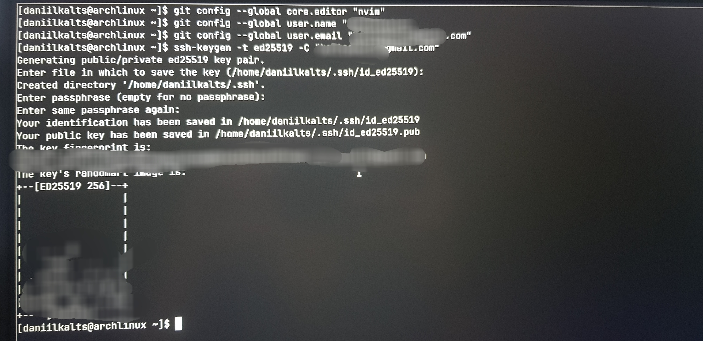
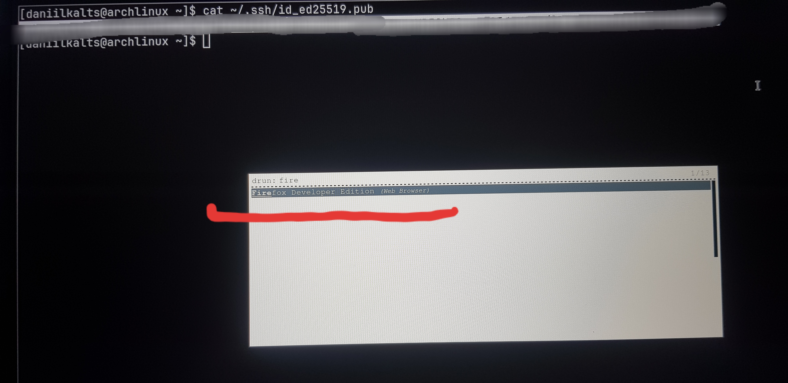
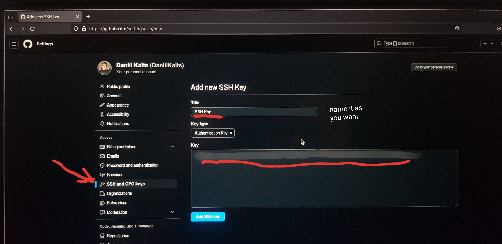
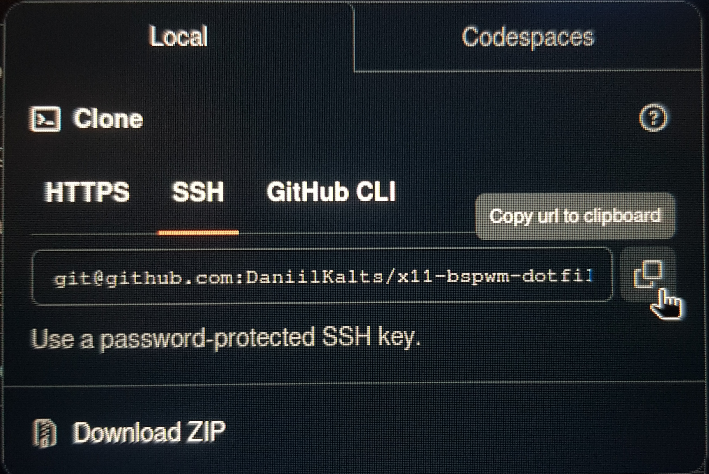
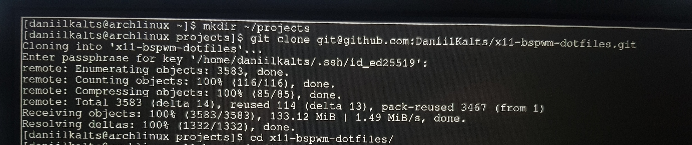
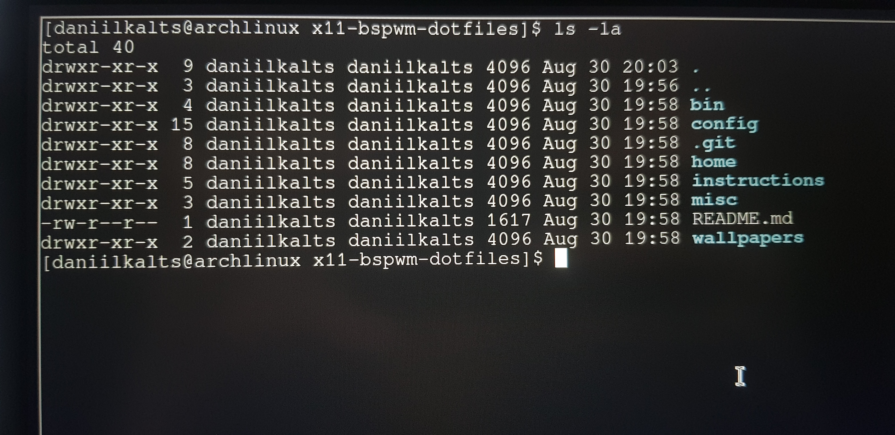

### 1. Install Firefox Developer Edition and OpenSSH

We'll install the following packages:

- **firefox-developer-edition**: A web browser tailored for developers with advanced tools.
- **openssh**: Secure networking utilities based on the SSH protocol.
- **pipewire-jack**: Low-latency audio server suitable for development tasks involving sound.

#### Steps to Install Firefox Developer Edition and OpenSSH:

1. To clear the terminal and start with a clean screen, press `Ctrl + L`.
2. Type `sudo pacman -S firefox-developer-edition openssh` and press `Enter`.
3. During the installation, choose `pipewire-jack` when prompted for an audio server.

   

### 2. Configure Git and Generate SSH Key

We'll configure Git with your preferred settings and generate an SSH key for secure authentication with GitHub.

- **Git**: A distributed version control system for tracking changes in your projects.
- **SSH Key**: A secure method to authenticate with GitHub without using passwords.

#### Steps to Configure Git and Generate an SSH Key:

1. To clear the terminal and start with a clean screen, press `Ctrl + L`.
2. Set your preferred text editor for Git: `git config --global core.editor "nvim"`
3. Set your GitHub username: `git config --global user.name "your_github_username"`
4. Set your GitHub email: `git config --global user.email "your_github_gmail"`
5. Generate an SSH key for GitHub: `ssh-keygen -t ed25519 -C "your_github_gmail"`

   

### 3. Add SSH Key to GitHub Profile

We'll add your newly generated SSH key to your GitHub profile to enable secure authentication without passwords.

- **SSH Key**: Provides secure access to your GitHub repositories.

#### Steps to Add SSH Key to GitHub Profile:

1. To clear the terminal and start with a clean screen, press `Ctrl + L`.
2. Display your SSH public key: `cat ~/.ssh/id_ed25519.pub`

   - Highlight the content and press `Ctrl + Shift + C` to copy it.

   

   

   - Fix permissions for the cache directory:

     ```plaintext
     sudo chown -R $USER:$USER ~/.cache
     sudo chmod -R 755 ~/.cache

     mkdir -p ~/.cache/mesa_shader_cache
     mkdir -p ~/.cache/mesa_shader_cache_db

     sudo chown -R $USER:$USER ~/.cache/mesa_shader_cache*
     sudo chmod -R 755 ~/.cache/mesa_shader_cache*
     ```

3. Press `Super + Space` to open the Rofi menu.
4. Type `firefox-developer-edition` and press `Enter` to launch it.

   - Focus on the terminal window and close it by pressing `Win + W`.

5. Sign in to your GitHub account and navigate to:

   - `Profile > Settings > SSH and GPG keys > New SSH key`
   - Paste your key and save.

   

### 4. Clone the Git Repository with Arch-Rice

We will clone a repository containing configuration files for a customized Arch Linux setup.

- **Git Repository**: Contains pre-configured files for an enhanced Arch Linux environment.

#### Steps to Clone the Git Repository:

1. Go to the URL: [https://github.com/DaniilKalts/x11-bspwm-dotfiles](https://github.com/DaniilKalts/x11-bspwm-dotfiles)
2. Copy the URL using the SSH option.

   

3. Close Firefox with `Win + W`, then open the terminal with `Win + Enter`.
4. Create a projects directory: `mkdir ~/projects`
5. Navigate to the projects directory: `cd ~/projects`
6. Clone the repository: `git clone git@github.com:DaniilKalts/x11-bspwm-dotfiles.git`
7. Change into the cloned directory: `cd x11-bspwm-dotfiles`

   

   

### Now, move to the fourth step!!!
